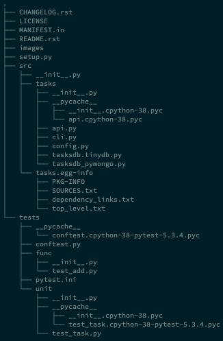

# Python Testing with Pytest 자습 로그
## 첩터 2. Writing Test Functions

### README.rst 에서 .rst 확장자를 처음 보다

지금까지 텍스트북을 읽으면서 자습했던 내용은 계속 bitbucket.org 에 private 로 관리하고 있었으나 이번
책부터 깃허브에 로그를 남기기로 하였습니다.
이 책의 챕터 1은 pytest 를 사용하는 가장 기본적인 방법을 다루고 있기 때문에 논외로 하였습니다.
제가 관심이 있는 부분은 이 책에서 다루는 예제의 디렉토리 형식 때문입니다. 아직까지 저는 패키지 등을
만들어서 배포를 해본 적이 없고, 대개 연구를 위한 실험용 코드만 짜는 정도의 수준이어서 이러한 정식
배포판 형태를 체험할 수 있는 책이 매우 반가웠습니다.

이 책은 대개 한국어 책에서 깃허브를 설명할 때 사용하는 .md 형식이 아니라 .rst 형식을 권장하고
있습니다. 이미지를 첨부할 수 있는지 우선 알아보려고 합니다.

일단 push 한 후 결과물을 확인하고 돌아오겠습니다.
